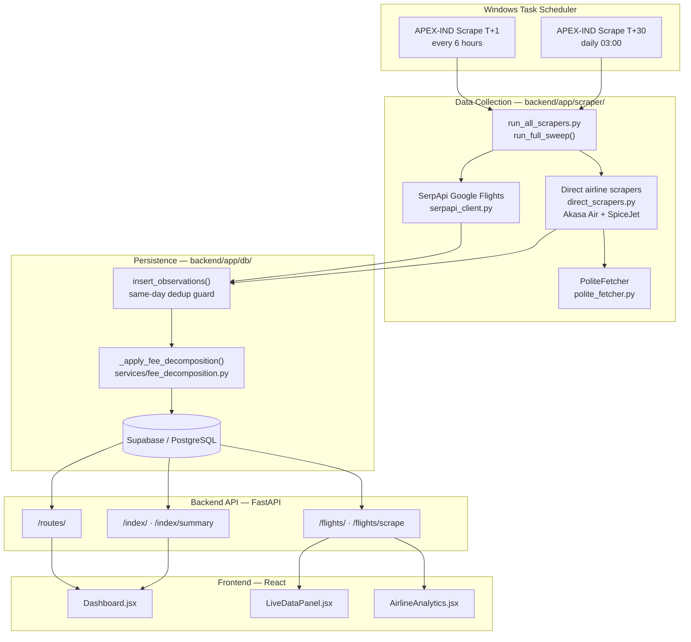
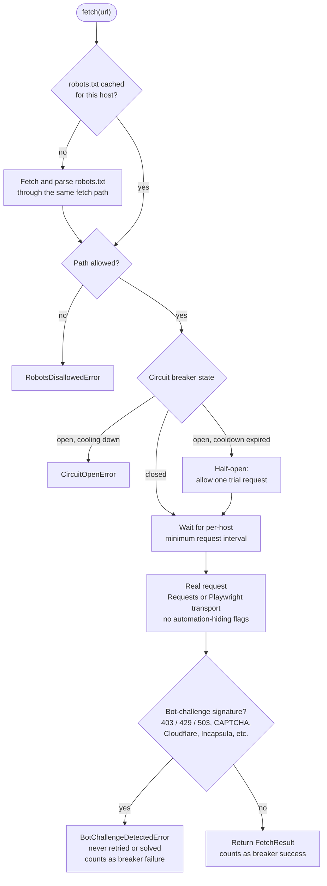
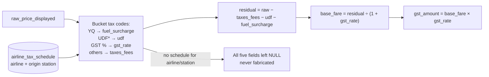
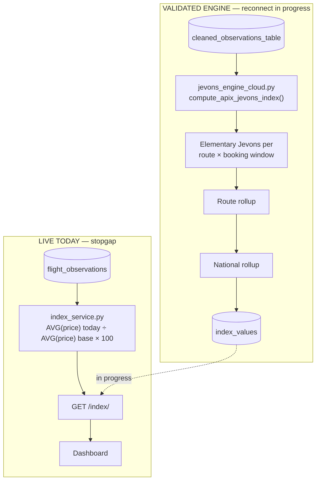
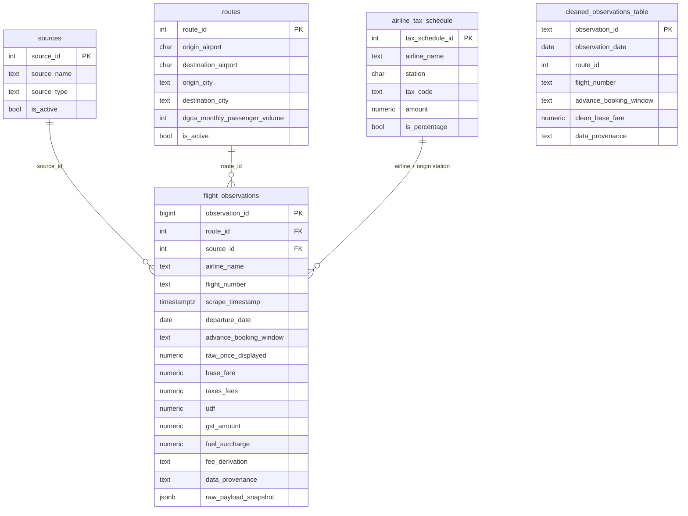

[README.md](https://github.com/user-attachments/files/32299549/README.md)
# APIx — Real-Time Airfare Price Index for India

**An open, compliance-first, high-frequency airfare price index for Indian domestic aviation, built for Smart India Hackathon 2026 (Problem Statement SIH26056, Ministry of Statistics and Programme Implementation).**


APIx collects real domestic airfares from licensed APIs and compliant airline websites. It splits each fare into base fare and regulated taxes and fees, then computes a statistically grounded price index. The methodology follows what national statistical offices (UK ONS, Istat, US BLS) use for web-scraped prices. The goal is a transparent, reproducible, multi-horizon airfare indicator that complements India's official Consumer Price Index (CPI).

> **Project status: proof of concept.** Data collection, compliance gating, fee decomposition, and a validated elementary Jevons engine are working today. Some pieces are still in progress: weighting, reconnecting the engine to the live API, and full GEKS transitivity. See [Project Status](#project-status) before you demo or cite any numbers.

---

## Table of Contents

- [Overview](#overview)
- [Project Status](#project-status)
- [Key Features](#key-features)
- [Architecture](#architecture)
  - [System Overview](#system-overview)
  - [Component Roles and Interdependencies](#component-roles-and-interdependencies)
  - [Data Collection Pipeline](#data-collection-pipeline)
  - [PoliteFetcher: The Compliance Gate](#politefetcher-the-compliance-gate)
  - [Fee Decomposition](#fee-decomposition)
  - [Index Methodology](#index-methodology)
  - [Database Schema](#database-schema)
- [Repository Structure](#repository-structure)
- [Prerequisites](#prerequisites)
- [Installation](#installation)
- [Configuration](#configuration)
- [Usage](#usage)
- [Roadmap](#roadmap)
- [Known Limitations](#known-limitations)
- [Compliance and Responsible Data Collection](#compliance-and-responsible-data-collection)
- [Contributing](#contributing)
- [License](#license)
- [Acknowledgements and References](#acknowledgements-and-references)
- [Glossary](#glossary)

---

## Overview

### The problem

Airfares are one of the most volatile prices households pay, and they feed directly into India's CPI transport sub-index. The Reserve Bank of India uses CPI for inflation-targeting monetary policy. The official figure, however, is monthly. It arrives about two weeks after month-end, and its airfare methodology is not publicly documented.

### An important framing

The SIH26056 problem statement describes Indian airfare collection as "manual," but that is out of date. The MoSPI CPI 2024 series (base 2024 = 100, first released February 2026) already collects airfares from well-known online platforms. APIx therefore **does not claim to invent online collection**. It adds what the current approach lacks:

- **A documented, open methodology** that anyone can reproduce and audit.
- **Multi-horizon sampling** across advance-booking windows (T+1, T+30 today; T+7, T+15, T+45 planned), instead of a single snapshot.
- **Tax and fee separation**, so the "pure" fare and the regulated add-ons can be indexed independently.
- **A statistically rigorous index** built on the GEKS-Jevons family of multilateral methods used by national statistical offices.
- **Higher frequency**, with daily observations that can be compared against the monthly official series.

### How this repository is organized conceptually

The project is defined by two complementary design documents, and this README combines them:

| Document | Role | Answers |
|---|---|---|
| **Research and Methodology Plan** | The *why*: statistical methodology, data-source choices, feature tiers, legal and compliance analysis, phased roadmap | Why Jevons and not Dutot? Why weight by booking window? Which sources are legitimate? |
| **System Architecture and Data Pipelines (v3)** | The *how*: the running system, its components, data flow, schema, automation, and PoC-scoped future work | How does one scrape become one database row? What does the dashboard actually compute? What is in progress? |

When the two documents differ, the architecture document takes precedence because it is newer and was verified against the live codebase. For example, the Kaggle 2019 historical dataset appears in the research plan but has since been **dropped entirely** from the project.

---

## Project Status

A verified snapshot of the live system:

| Metric | Value |
|---|---|
| `flight_observations` rows | 2,574 (100% `real_scraped`) |
| Rows with fee decomposition | 2,296 (89.2%) |
| `airline_tax_schedule` rows | 141, covering 4 airlines |
| `cleaned_observations_table` rows | 930 (static snapshot) |
| Routes | 7 active, 8 total |
| Data sources | 4 |
| Booking windows collected | T+1, T+30 |
| PoliteFetcher test suite | 25 / 25 passing |

**What is real today:**

- Automated collection from SerpApi Google Flights and direct airline scrapers (Akasa Air, SpiceJet).
- A compliance gate (robots.txt, per-host rate limiting, circuit breaker, bot-challenge abort).
- Deterministic fee decomposition from airline tariff schedules, which never fabricates values.
- A validated elementary Jevons engine (`jevons_engine_cloud.py`).
- A React dashboard with a live airline analytics tab backed by real data.

**What is not yet true (read before demoing):**

- The live `GET /index/` endpoint serves a **stopgap** calculation: a ratio of daily average prices. It does **not** yet use the real Jevons engine, although the dashboard tab is labeled "GEKS." The reconnect is in progress.
- **Full GEKS transitivity is not implemented.** Elementary Jevons is built; GEKS-Jevons is the stated production target.
- The Hero section, Footer, and Whitepaper modal currently show headline figures (such as "4.2M+ fares," "120 routes," "15 airlines") that do not reflect live data. **A fix is in progress.**
- Two dashboard tabs (Market Scenario Simulator, Corridor Telemetry) use mock data. They are correctly badged "Simulated Data," but the CSV/JSON export includes those values.

---

## Key Features

### Available now

- **Dual-path fare collection.** Licensed SerpApi Google Flights queries run alongside Playwright-based direct airline scrapers, and both converge on a single persistence path.
- **Compliance-first fetching.** Every direct request passes through `PoliteFetcher`. It enforces robots.txt, rate limits each host, trips a circuit breaker on repeated failures, and aborts instead of solving CAPTCHAs or bot challenges.
- **Base fare vs. taxes/fees decomposition.** Each observed price is split into `base_fare`, `taxes_fees`, `udf` (User Development Fee), `gst_amount`, and `fuel_surcharge` using published airline tariff schedules.
- **Data provenance tracking.** Every row records whether it was `real_scraped`, and whether fees were `derived_from_tariff_sheet` or `directly_observed`. The raw payload is kept as JSONB for auditability.
- **Same-day deduplication.** Re-running a sweep on the same IST day does not duplicate observations.
- **Scheduled multi-horizon sweeps.** A T+1 sweep runs every 6 hours and a T+30 sweep runs daily at 03:00.
- **REST API** built on FastAPI, with `/routes`, `/flights`, and `/index` resources and auto-generated OpenAPI docs.
- **Interactive React dashboard** with live data panels, per-airline price indices with route and booking-window filters, and a methodology whitepaper.

### In progress (PoC-critical)

- Reconnecting the validated Jevons engine to the live API through a new `index_values` table.
- DGCA passenger-traffic-weighted national rollup. The weight data already exists in `routes`.
- Booking-window weighting based on a truncated log-normal booking-lead-time distribution.
- Correcting the headline claims on the Hero, Footer, and Whitepaper.

### Planned

- Live overlay against the official MoSPI CPI transport sub-index (undecided for this round).
- True GEKS-Jevons transitivity with rolling-window splicing (Post-PoC).
- Anomaly and price-spike detection, and an explainable "book now or wait" indicator (Post-PoC).

---

## Architecture

### System Overview



### Component Roles and Interdependencies

| Layer | Component(s) | Role | Depends on | Consumed by |
|---|---|---|---|---|
| **Scheduling** | Windows Task Scheduler, `run_sweep_t1.bat`, `run_sweep_t30.bat` | Triggers collection sweeps for each booking window and writes run summaries to logs | Python environment, `backend/` working directory | Collection layer |
| **Collection: API path** | `scraping_service.py`, `serpapi_client.py`, `flight_parser.py` | Queries SerpApi Google Flights and parses structured JSON into flight records | SerpApi key, active routes from DB | Persistence layer |
| **Collection: direct path** | `direct_scrapers.py` (`scrape_akasa`, `scrape_spicejet`) | Drives airline booking pages with Playwright, extracts fares, and validates station matches | `PoliteFetcher`, Playwright browsers | Persistence layer |
| **Compliance gate** | `polite_fetcher.py` | Enforces robots.txt, rate limits, circuit breaking, and bot-challenge detection for direct requests | Network access | Direct scrapers |
| **Persistence** | `db/queries.py` (`insert_observations`) | Deduplicates same-day observations and writes rows idempotently (`ON CONFLICT DO NOTHING`) | Database connection, fee decomposition | Database |
| **Fee decomposition** | `services/fee_decomposition.py` | Splits the displayed price into five fee components using `airline_tax_schedule` | `airline_tax_schedule` table | Persistence layer |
| **Storage** | Supabase / PostgreSQL | System of record for routes, sources, observations, tax schedules, cleaned data, and (soon) index values | — | API, index engine |
| **Index engine** | `jevons_engine_cloud.py` | Computes elementary Jevons indices per route and booking window, with route and national rollups | `cleaned_observations_table` | `index_values` table (in progress) |
| **API** | FastAPI app in `backend/app/main.py` | Exposes REST resources for routes, flights, and index values | Database | Frontend, external consumers |
| **Frontend** | React app in `frontend/src/` | Dashboard, live data panels, airline analytics, and methodology content | Backend API | End users |

The key design principle is that **both collection paths converge on one persistence function**. Deduplication, fee decomposition, and provenance tagging are therefore implemented once and applied the same way to every source.

### Data Collection Pipeline

A single direct-airline observation flows through the system like this:

1. **Trigger.** Task Scheduler runs `run_sweep_t1.bat` or `run_sweep_t30.bat`. Each script invokes `python -m app.scraper.run_all_scrapers --window <T+1|T+30>`.
2. **Route selection.** `run_full_sweep()` loads the active routes with `get_active_routes(conn)`.
3. **Compliant first navigation.** For each route, `scrape_akasa()` or `scrape_spicejet()` requests the airline page through `PoliteFetcher.fetch()`. The fetcher checks robots.txt, waits for the per-host rate limit, checks the circuit breaker, makes the request, and scans the response for bot challenges.
4. **Interactive extraction.** The scraper continues on the same page: it sets the date picker, extracts fares, and validates that the origin and destination stations match.
5. **Persistence.** The flight records are passed to `insert_observations(observations, route_id, source_id)`.
6. **Deduplication.** Observations already recorded on the same IST day for the same `flight_number`, departure date, and booking window are skipped.
7. **Fee decomposition.** Rows without a `base_fare` are decomposed using the matching `airline_tax_schedule` rows.
8. **Write.** Rows are inserted with `ON CONFLICT DO NOTHING`.
9. **Summary.** A sweep summary (rows inserted per source, plus any errors) is appended to `backend/logs/sweep_t1.log` or `sweep_t30.log`.

The SerpApi path follows the same flow through `scraping_service.run_scrape()` → `serpapi_client.get_flights()` → `flight_parser.parse_flights()`, and ends in the same `insert_observations()` call.

### PoliteFetcher: The Compliance Gate

`PoliteFetcher` is the only permitted network path for direct scraping. It enforces rules that **cannot be disabled by configuration**.



Behavior worth knowing:

- A missing robots.txt, or one that returns 401, is treated as allow-all. A **403 on robots.txt is treated as a bot challenge**, not as a disallow.
- robots.txt is cached per host, with host names normalized to lowercase.
- Transports never use automation-hiding or stealth flags.
- A detected bot challenge is never retried, bypassed, or solved.

### Fee Decomposition

Each displayed fare is split into five components using the airline's published tax schedule for the origin station.



**Worked example.** Take a displayed fare of ₹5,000. The schedule has ₹400 of airport and other charges, ₹200 of UDF, no fuel surcharge, and 5% GST.

```text
residual    = 5000 − 400 − 200 − 0      = 4400.00
base_fare   = 4400 ÷ 1.05               = 4190.48
gst_amount  = 4190.48 × 0.05            =  209.52
check       = 4190.48 + 209.52 + 400 + 200 = 5000.00  ✓
fee_derivation = 'derived_from_tariff_sheet'
```

### Index Methodology

#### Why Jevons

At the smallest level (one route and one booking window on one day), APIx averages **price relatives**, meaning today's price divided by the base price, using the **geometric mean**. This is the Jevons index:

$$
I_{\text{Jevons}} = \exp\left(\frac{1}{n}\sum_{i=1}^{n}\ln\frac{p_{i,t}}{p_{i,0}}\right)\times 100
$$

A geometric mean treats a doubling and a halving as cancelling out, which is the correct behavior for prices. It also stops a single expensive fare from dominating the result, which is a weakness of the Dutot index (an average of rupee prices). ONS uses Jevons as the elementary building block for web-scraped data.

#### Live stopgap vs. validated engine

The system currently contains two separate index pipelines that are not yet connected:



The difference matters numerically. Consider three flights:

```python
import math

base    = [4000, 5000, 3000]
current = [4400, 4750, 3600]

# Live stopgap: ratio of averages
stopgap = (sum(current) / len(current)) / (sum(base) / len(base)) * 100
# -> 106.25

# Validated engine: Jevons (geometric mean of price relatives)
relatives = [c / b for c, b in zip(current, base)]          # 1.10, 0.95, 1.20
jevons = math.exp(sum(math.log(r) for r in relatives) / len(relatives)) * 100
# -> 107.84
```

#### Target methodology

The full design, taken from the research plan, has four stages:

1. **Elementary Jevons** index per route × booking window, per day. *(Built.)*
2. **GEKS-Jevons over a rolling window** (roughly 60–90 days) with mean splicing, to eliminate chain drift caused by daily flight churn. *(Post-PoC.)*
3. **Booking-window weighting.** Window indices are combined with a weighted geometric mean, using weights from a truncated log-normal booking-lead-time distribution, following ONS (Ayoubkhani & Thomas). Without this, the index would be biased toward last-minute fares that few travelers actually pay. Results will be published under two or three alternative weight sets as a sensitivity band. *(In progress; requires T+7, T+15, and T+45 data.)*
4. **DGCA traffic weighting.** Route indices are combined into a national index using monthly passenger volumes from `routes.dgca_monthly_passenger_volume`. *(In progress; data available.)*

### Database Schema



| Table | Purpose |
|---|---|
| `sources` | Registry of data sources. `source_type` is `airline_direct`, `ota`, or `api`. |
| `routes` | Route basket, including the DGCA passenger volumes used for national weighting. |
| `flight_observations` | One row per observed fare, with decomposed fees, provenance, and raw payload. |
| `airline_tax_schedule` | Per-airline, per-station tax codes (ASF, CUTE, GST, PSF, RCS, UDF_*, YQ, and others). |
| `cleaned_observations_table` | Cleaned, validated fares that feed the Jevons engine. |
| `index_values` | *(In progress.)* Computed index series served by the API. DDL is in `jevons_engine/create_index_table.sql`. |

---

## Repository Structure

Only paths confirmed in the architecture audit are listed below.

```text
air_fair_index-SIH-/
├── backend/
│   ├── app/
│   │   ├── main.py                    # FastAPI app; mounts /routes, /flights, /index
│   │   ├── api/
│   │   │   └── index.py               # /index endpoints (currently stopgap calculation)
│   │   ├── scraper/
│   │   │   ├── run_all_scrapers.py    # run_full_sweep(); CLI entry point
│   │   │   ├── serpapi_client.py      # SerpApi Google Flights client
│   │   │   ├── direct_scrapers.py     # Akasa Air + SpiceJet Playwright scrapers
│   │   │   └── polite_fetcher.py      # Compliance gate
│   │   ├── services/
│   │   │   ├── scraping_service.py    # SerpApi collection orchestration
│   │   │   ├── fee_decomposition.py   # decompose_fare(), _aggregate_schedule()
│   │   │   └── index_service.py       # Stopgap index (to be replaced)
│   │   └── db/
│   │       └── queries.py             # insert_observations(), _apply_fee_decomposition()
│   ├── run_sweep_t1.bat               # Scheduler wrapper: T+1 sweep
│   ├── run_sweep_t30.bat              # Scheduler wrapper: T+30 sweep
│   └── logs/                          # Sweep logs (gitignored)
├── jevons_engine/
│   ├── jevons_engine_cloud.py         # Validated elementary Jevons engine
│   └── create_index_table.sql         # DDL for index_values
└── frontend/
    └── src/
        ├── Dashboard.jsx              # Main dashboard, tabs, CSV/JSON export
        ├── LiveDataPanel.jsx          # Live flight observations
        ├── AirlineAnalytics.jsx       # Per-airline price indices (real data)
        ├── WhitepaperModal.jsx        # Methodology write-up
        └── PipelineSection.jsx        # GEKS methodology walkthrough
```

---

## Prerequisites

| Requirement | Version / notes |
|---|---|
| **Git** | Any recent version |
| **Python** | 3.10 or newer recommended |
| **Node.js and npm** | Node 18 LTS or newer, for the React frontend |
| **PostgreSQL** | A [Supabase](https://supabase.com) project (recommended) or any PostgreSQL 14+ instance |
| **Playwright browsers** | Installed with `playwright install` (Chromium is sufficient) |
| **SerpApi account** | An API key from [serpapi.com](https://serpapi.com). The free tier is about 100 searches per month, and cached searches are free. |
| **Operating system** | Windows for the included Task Scheduler wrappers. macOS and Linux work with cron (see [Scheduling](#4-schedule-automated-sweeps)). |

Useful background knowledge: FastAPI, PostgreSQL, Playwright, React, and basic price-index statistics (see the [Glossary](#glossary)).

---

## Installation

### 1. Clone the repository

```bash
git clone https://github.com/Aarnav52/AeroStat.git
cd AeroStat
```

### 2. Set up the backend

```bash
cd backend
python -m venv .venv

# Windows
.venv\Scripts\activate
# macOS / Linux
source .venv/bin/activate

pip install -r requirements.txt
playwright install chromium
```

### 3. Configure environment variables

Create `backend/.env` as described in [Configuration](#configuration).

### 4. Prepare the database

1. Create a Supabase project, or provision a PostgreSQL database.
2. Create the core tables (`sources`, `routes`, `flight_observations`, `airline_tax_schedule`, `cleaned_observations_table`) following the [Database Schema](#database-schema).
3. Seed the `sources` and `routes` tables, including `dgca_monthly_passenger_volume` for each route.
4. Load airline tax schedules into `airline_tax_schedule`. Without a schedule for an airline and station, fee decomposition is skipped for those rows. This is intentional.
5. *(Optional, in progress.)* Create the `index_values` table:

   ```bash
   psql "$DATABASE_URL" -f ../jevons_engine/create_index_table.sql
   ```

### 5. Set up the frontend

```bash
cd ../frontend
npm install
```

### 6. Verify the installation

```bash
cd ../backend
pytest
```

The `PoliteFetcher` suite should report 25 passing tests.

---

## Configuration

Create `backend/.env`:

```dotenv
# PostgreSQL / Supabase connection string
DATABASE_URL=postgresql://<user>:<password>@<host>:5432/<database>

# SerpApi Google Flights
SERPAPI_API_KEY=<your-serpapi-key>
```

> Variable names must match what the backend configuration reads. Check `backend/app/` for the settings module if your values are not being picked up. Never commit `.env` files or API keys.

`PoliteFetcher` exposes tunable settings such as the per-host minimum request interval and the circuit-breaker cooldown. **robots.txt enforcement and bot-challenge aborts are deliberately not configurable.**

---

## Usage

### 1. Run the backend API

```bash
cd backend
uvicorn app.main:app --reload --port 8000
```

Interactive OpenAPI documentation is then available at:

- Swagger UI: <http://localhost:8000/docs>
- ReDoc: <http://localhost:8000/redoc>

### 2. Query the API

```bash
# List routes in the basket
curl http://localhost:8000/routes/

# Retrieve flight observations
curl http://localhost:8000/flights/

# Current index series and summary
curl http://localhost:8000/index/
curl http://localhost:8000/index/summary
```

`/flights/scrape` triggers collection on demand. See `/docs` for its HTTP method and parameters.

From Python:

```python
import requests

BASE = "http://localhost:8000"

routes = requests.get(f"{BASE}/routes/", timeout=10).json()
index = requests.get(f"{BASE}/index/", timeout=10).json()

print(f"{len(routes)} routes loaded")
print(index)
```

> **Note:** until the reconnect lands, `/index/` returns the stopgap ratio-of-averages calculation, not the validated Jevons engine output. Do not present its values as a Jevons or GEKS index.

### 3. Run a collection sweep manually

```bash
cd backend

# Last-minute window
python -m app.scraper.run_all_scrapers --window T+1

# One-month-ahead window
python -m app.scraper.run_all_scrapers --window T+30
```

Each run prints a sweep summary with rows inserted per source and any errors. Running the same sweep again on the same IST day is safe, because deduplication prevents duplicate rows.

### 4. Schedule automated sweeps

**Windows (matches the production setup):**

```powershell
schtasks /Create /TN "APEX-IND Scrape T+1" ^
  /TR "C:\path\to\air_fair_index-SIH-\backend\run_sweep_t1.bat" ^
  /SC HOURLY /MO 6 /ST 00:00

schtasks /Create /TN "APEX-IND Scrape T+30" ^
  /TR "C:\path\to\air_fair_index-SIH-\backend\run_sweep_t30.bat" ^
  /SC DAILY /ST 03:00
```

In Task Scheduler, enable **"Start the task even if the computer is on batteries"** on laptops. Logs are appended to `backend/logs/sweep_t1.log` and `backend/logs/sweep_t30.log`.

**macOS / Linux (cron equivalent):**

```cron
0 */6 * * *  cd /path/to/air_fair_index-SIH-/backend && .venv/bin/python -m app.scraper.run_all_scrapers --window T+1  >> logs/sweep_t1.log  2>&1
0 3 * * *    cd /path/to/air_fair_index-SIH-/backend && .venv/bin/python -m app.scraper.run_all_scrapers --window T+30 >> logs/sweep_t30.log 2>&1
```

### 5. Run the frontend dashboard

```bash
cd frontend
npm run dev    # or: npm start, depending on the configured build tool
```

The dashboard provides:

| View | Data |
|---|---|
| Main index tab | Live `/index/` stopgap series (labeled "GEKS"; see the status caveats) |
| Live data panel | Real flight observations from `/flights/` |
| Airline Price Indices & Weights | Real per-airline average-fare index with route and booking-window filters |
| Market Scenario Simulator | **Mock data**, badged "Simulated Data" |
| Corridor Telemetry & Governance | **Mock data**, badged |
| Technical Whitepaper | Methodology write-up (headline figures being corrected) |

> **Before any demo:** the CSV/JSON export button exports whatever is on screen, including the mock tabs. Export only from the live data views.

### 6. Inspect data quality

Useful SQL checks against the database:

```sql
-- Share of observations with fee decomposition
SELECT
  COUNT(*)                                   AS total,
  COUNT(base_fare)                           AS decomposed,
  ROUND(100.0 * COUNT(base_fare) / COUNT(*), 1) AS pct_decomposed
FROM flight_observations;

-- Observations per route and booking window
SELECT r.origin_airport, r.destination_airport, f.advance_booking_window, COUNT(*)
FROM flight_observations f
JOIN routes r USING (route_id)
GROUP BY 1, 2, 3
ORDER BY 1, 2, 3;

-- Active routes missing DGCA passenger volume
SELECT route_id, origin_city, destination_city
FROM routes
WHERE is_active AND dgca_monthly_passenger_volume IS NULL;
```

---

## Roadmap

Items are tagged using the team's current proof-of-concept scoping.

| Item | Scope | Status | Dependency |
|---|---|---|---|
| Correct headline claims on Hero, Footer, and Whitepaper | PoC-critical | 🟡 In progress | — |
| Fix `index_values` schema | PoC-critical | 🟡 In progress | — |
| Run Jevons engine on a schedule | PoC-critical | ⚪ Not started | `index_values` |
| Rewire `GET /index/` to read `index_values` | PoC-critical | 🟡 In progress | Scheduled engine |
| DGCA-weighted national rollup | PoC-critical | 🟡 In progress | API rewire |
| Booking-window weighting (truncated log-normal) | PoC-critical | 🟡 In progress | T+7 / T+15 / T+45 data |
| Merge cleaning pipeline from `cleaning-normalization-pipeline` | PoC-critical | ⚪ Needs review | Strip vendored `.dist/` folder |
| MoSPI CPI transport sub-index overlay | Undecided | ⚪ Not committed | API rewire |
| Collect T+7, T+15, T+45 windows | Post-PoC* | ⚪ Not started | SerpApi quota |
| GEKS-Jevons transitivity with rolling-window splicing | Post-PoC | ⚪ Deferred | API rewire |
| Anomaly and price-spike detection (ARIMA, Isolation Forest) | Post-PoC | ⚪ Deferred | CPI overlay |
| Explainable "book now or wait" indicator | Post-PoC | ⚪ Deferred | — |

\* Could be pulled forward if booking-window weighting needs it for the PoC.

**Longer-term phases (from the research plan):**

- **Rigor and differentiation.** Rolling-window GEKS-Jevons, weighting sensitivity analysis, forecasting, and event correlation (festivals, ATF fuel prices, capacity changes).
- **Production and scale.** Expand to 30–50 routes, add orchestration (Airflow or Prefect), a public REST API and open-data portal, and formal validation against DGCA tariff sheets.
- **Institutional pathway.** Engage MoSPI and DGCA, propose APIx as a supplementary high-frequency indicator, and publish a methodology white paper.

**Key dates:** college-internal PPT round on 16 September 2026; official SIH idea submission on 30 September 2026.

---

## Known Limitations

| Limitation | Impact | Plan |
|---|---|---|
| Live API serves a stopgap index, not the Jevons engine | Dashboard values are not a methodologically valid index | Reconnect in progress |
| "GEKS" label on the dashboard is not yet accurate | Could overstate what is built | Present elementary Jevons as built, GEKS as target |
| Only T+1 and T+30 windows are collected | Booking-window weighting cannot be applied yet | Add T+7, T+15, T+45 |
| `cleaned_observations_table` is a static snapshot | Engine input does not refresh automatically | Merge the tested pipeline from the unmerged branch |
| No MoSPI CPI overlay | Headline "measurement lag" visual is not available | Undecided for this round |
| Ahmedabad–Delhi route is missing DGCA passenger volume | That route cannot be traffic-weighted | Data entry fix |
| Akasa direct scraper has thin coverage on Bengaluru routes | Fewer direct observations there | The site expects "Bangalore"; SerpApi covers these routes meanwhile |
| Google Flights–derived data may favor cheapest fares and under-represent some low-cost-carrier inventory | Possible coverage bias | Disclosed; direct-airline collection supplements it |
| Booking-lead-time distribution is estimated from proxies | Weights are assumptions | Publish assumptions and sensitivity bands |
| SerpApi free tier (~100 searches/month) | Limits route × window coverage | Cache aggressively, subset routes, or use a paid tier |

---

## Compliance and Responsible Data Collection

APIx is designed to be a **good-faith, low-impact** data collector. These principles are non-negotiable for contributors.

1. **Prefer licensed APIs.** SerpApi Google Flights is the primary source. Direct scraping is reserved for sources whose robots.txt and terms permit it.
2. **Always use PoliteFetcher for direct requests.** No scraper may make untracked network calls outside the compliance gate.
3. **Never bypass protections.** No CAPTCHA solving, stealth or automation-hiding flags, fingerprint spoofing, or retries after a bot challenge.
4. **Respect rate limits.** Per-host intervals and circuit breakers protect airline infrastructure.
5. **Collect prices only.** No personal data is collected or logged, consistent with the Digital Personal Data Protection Act, 2023.
6. **Publish aggregates, not raw fares.** A derived index is a statistical product. Redistributing raw scraped fares carries higher database-rights risk.
7. **Never fabricate data.** Missing fee schedules leave fields `NULL`. Every row carries `data_provenance`, and simulated views must be clearly badged.
8. **Maintain a compliance register** recording robots.txt and terms-of-service status for every source.

> **Legal note:** the legal position on web scraping in India is unsettled. Relevant considerations include Section 43 of the Information Technology Act, 2000, and database-copyright case law. This project is not legal advice. Anyone deploying APIx should seek their own legal review.

**Recommended safe validation sources:**

- **DGCA tariff sheets**, which scheduled domestic airlines must publish on their websites under Rule 135 of the Aircraft Rules, 1937.
- **DGCA passenger-traffic data**, from the DGCA portal or the community mirror [`Vonter/india-aviation-traffic`](https://github.com/Vonter/india-aviation-traffic) (Open Database License).
- **MoSPI CPI transport sub-index**, from the [e-Sankhyiki portal](https://esankhyiki.mospi.gov.in).

---

## Contributing

Contributions from developers, statisticians, and domain experts are welcome.

### Getting started

1. **Fork** the repository and clone your fork.
2. **Create a branch** from `main` with a descriptive name:

   ```bash
   git checkout -b feature/booking-window-weights
   ```

3. **Make your changes**, following the guidelines below.
4. **Run the tests** and make sure they pass:

   ```bash
   cd backend && pytest
   ```

5. **Commit** with clear messages, for example `feat: add DGCA-weighted national rollup` or `fix: normalize Bengaluru station name for Akasa`.
6. **Open a pull request** against `main`. Describe what changed, why, and how it was tested.

### Contribution guidelines

- **Data integrity comes first.** Never introduce code that fabricates, imputes without flagging, or silently alters observed prices. Preserve `data_provenance` and `fee_derivation` semantics.
- **Route all direct network access through `PoliteFetcher`.** Pull requests that add scraping outside the compliance gate, or add bypass logic, will not be accepted.
- **Keep persistence centralized.** New sources must write through `insert_observations()` so deduplication and fee decomposition apply consistently.
- **Document methodology changes.** Any change to index formulas, weighting, or cleaning rules should cite its methodological basis (for example ONS, Istat, or BLS publications) and update this README.
- **Label honestly.** UI copy must not claim features, coverage, or data volumes that the live system does not have. Use "planned" or "target" for unbuilt capabilities, and badge mock data.
- **Add tests** for new logic, especially index computation, fee decomposition, and compliance behavior.
- **Never commit** secrets, `.env` files, logs, or vendored dependencies. Declare dependencies in `requirements.txt` or `package.json`.

### Notes on existing branches

| Branch | Guidance |
|---|---|
| `cleaning-normalization-pipeline` | Contains a real, tested cleaning pipeline (`airfare_cpi/pipeline.py`, `cleaned_table.py`, `pipeline_runner.py`, `tests/test_pipeline.py`) that produces the `cleaned_observations_table` schema. **Before merging, remove the committed `.dist/` vendored dependency folder** and declare those packages in `requirements.txt`. |
| `feature/flight-scraper-unbundling` | **Stale — do not merge.** It branched before the current PoliteFetcher, direct-scraper, and Jevons-engine work, and uses an incompatible SQLite schema. Merging it would delete working code. Mine it for scraping ideas only. |

### Reporting issues

When opening an issue, include the steps to reproduce, expected vs. actual behavior, relevant log excerpts from `backend/logs/` with secrets removed, and your environment (OS, Python, and Node versions).

---

## License

The license for this project has not yet been finalized. Until a `LICENSE` file is added to the repository root, all rights are reserved by the project authors.

The [MIT License](https://opensource.org/licenses/MIT) or [Apache License 2.0](https://www.apache.org/licenses/LICENSE-2.0) are recommended for the code, since both suit an open, reproducible public-statistics project. Published index data could be released under an open data license such as [CC BY 4.0](https://creativecommons.org/licenses/by/4.0/).

Third-party data keeps its own terms. Examples include the DGCA traffic mirror (Open Database License), SerpApi results (SerpApi Terms of Service), and MoSPI publications (Government of India terms).

---

## Acknowledgements and References

### Acknowledgements

- **Smart India Hackathon 2026** and the **Ministry of Statistics and Programme Implementation (MoSPI)** for problem statement SIH26056.
- **Directorate General of Civil Aviation (DGCA)** for passenger-traffic data and the tariff-sheet disclosure mechanism.
- **[Vonter/india-aviation-traffic](https://github.com/Vonter/india-aviation-traffic)** for a clean, openly licensed mirror of DGCA traffic data.
- **[SerpApi](https://serpapi.com)**, **[Supabase](https://supabase.com)**, **[FastAPI](https://fastapi.tiangolo.com)**, **[Playwright](https://playwright.dev)**, and **[React](https://react.dev)**, whose tools power the stack.
- The APIx project team and all contributors.

### Methodological references

- **UK Office for National Statistics (ONS).** *Research indices using web scraped price data*; *A comparison of index number methodology used on UK web scraped price data* (Methodology Working Paper 12); *Introducing multilateral index methods into consumer price statistics*.
- **Ayoubkhani, D. & Thomas, H.** (2022). Estimating weights for web-scraped price quotes using statistical distributions. *Journal of Official Statistics*. See also ONS (September 2020), *Using statistical distributions to estimate weights for web-scraped price quotes*.
- **Polidoro, F., Giannini, R., Lo Conte, R., Mosca, S. & Rossetti, F.** (2015). Web scraping techniques to collect data on consumer electronics and airfares for Italian HICP compilation. *Statistical Journal of the IAOS*, 31(2), 165–176. DOI: [10.3233/SJI-150901](https://doi.org/10.3233/SJI-150901).
- **de Haan, J. & van der Grient, H.** (2009). Eliminating chain drift in price indexes based on scanner data. *Journal of Econometrics*.
- **Ivancic, L., Diewert, W. E. & Fox, K. J.** Rolling-Year GEKS and the multilateral index literature.
- **Lent, J. & Dorfman, A.** (2005). Transaction-based air travel price index research. *Monthly Labor Review*, US Bureau of Labor Statistics.
- **US Bureau of Labor Statistics.** CPI airline fares methodology (fixed advance-reservation specifications, passenger-weighted sampling).
- **Billion Prices Project / PriceStats (MIT)**, for evidence that daily online prices can track official inflation.
- **MoSPI.** CPI 2024 (Base 2024 = 100) FAQ, Annexure V, and the PIB first press release on the new CPI series.

---

## Glossary

| Term | Meaning |
|---|---|
| **APIx** | Airfare Price Index, this project's output. Automation tasks and some UI use the name "APEX-IND." |
| **Price index** | A number tracking how prices move relative to a base period set to 100. A reading of 110 means prices are 10% above the base. |
| **Elementary aggregate** | The smallest group of similar prices averaged first. Here, one route × one booking window. |
| **Price relative** | Current price ÷ base price for the same item. |
| **Jevons index** | Geometric mean of price relatives; the elementary formula used here. |
| **Dutot index** | Ratio of average prices. Expensive outliers can dominate it, so it is not used. |
| **Chain drift** | Distortion that builds up when an index is chained period to period while items churn. |
| **GEKS / GEKS-Jevons** | A multilateral method comparing every period with every other period in a window, which removes most chain drift. Named after Gini, Éltető, Köves, and Szulc. |
| **Rolling window and splicing** | Recomputing over a fixed-length moving window and stitching the results into one continuous series. |
| **Booking window (T+n)** | How many days before departure a fare was observed. T+1 means one day ahead. |
| **Truncated log-normal** | A right-skewed distribution, cut off at set bounds, used to estimate booking-window weights. |
| **UDF** | User Development Fee, a regulated airport charge. |
| **YQ** | Airline fuel surcharge tax code. |
| **COICOP 07.3** | International spending classification group for passenger transport services, which includes airfares. |
| **CPI** | Consumer Price Index, India's official retail inflation measure published by MoSPI. |
| **DGCA** | Directorate General of Civil Aviation, India's aviation regulator. |
| **robots.txt** | A file where websites state which paths automated clients may access. |
| **Circuit breaker** | A pattern that stops sending requests to a host after repeated failures, then cautiously retries after a cooldown. |

---

<p align="center">
  Built for Smart India Hackathon 2026 · SIH26056 · Ministry of Statistics and Programme Implementation
</p>
